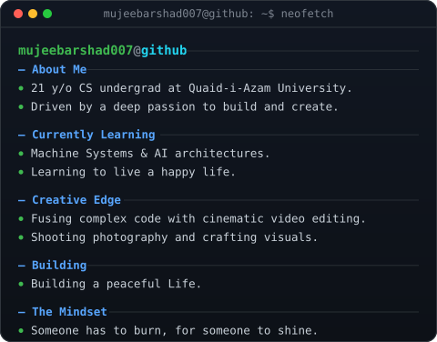

<h1 align="center">Meet Mujeeb 👋</h1>

 
   

<!-- Borderless table to perfectly lock the SVGs together and fix side gaps -->

  <table style="border: none; border-collapse: collapse; padding: 0; margin: 0; background-color: transparent;">
    <tr style="border: none;">
      <td valign="top" style="border: none; padding: 0; margin: 0;"></td>
      <td valign="top" style="border: none; padding: 0; margin: 0;"></td>
    </tr>
  </table>

  Computer Scientist · Creative Technologist · Builder

  
  
  
  

---

Check out my FIFA Card
https://gitfut.com/mujeebarshad007

📬 **mujeeb.arshad001@gmail.com**

---

## Tech Stack

**Languages**

**Cloud & Infrastructure**

**Data & AI**

**Tools & Workflow**

**Creative**

---

<h2 align="center">📊 My GitHub Progress</h2>

<table align="center">
<tr>
<td>

</td>
<td>

</td>
</tr>
</table>

<!-- Custom Heatmap Moved UP -->

<h2 align="center">🔥 Super Contributor Badges</h2>

  

  

